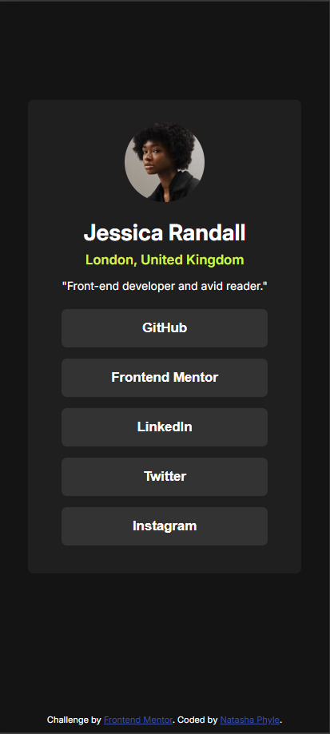
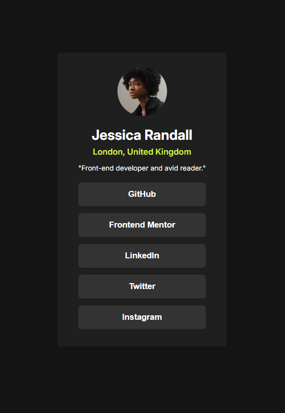

# Frontend Mentor - Social links profile solution

This is a solution to the [Social links profile challenge on Frontend Mentor](https://www.frontendmentor.io/challenges/social-links-profile-UG32l9m6dQ). Frontend Mentor challenges help you improve your coding skills by building realistic projects. 

## Table of contents

- [Overview](#overview)
  - [The challenge](#the-challenge)
  - [Screenshot](#screenshot)
  - [Links](#links)
- [My process](#my-process)
  - [Built with](#built-with)
  - [What I learned](#what-i-learned)
  - [Continued development](#continued-development)
- [Author](#author)

## Overview

### The challenge

Users should be able to:

- See hover and focus states for all interactive elements on the page

### Screenshot

### Links

- Solution URL: [My Solution](https://www.frontendmentor.io/solutions/social-links-profile-gGOh0mlbQi)
- Live Site URL: [Live Site URL](https://nastashacloser.github.io/social-links-profile-main/)

## My process

### Built with

- Semantic HTML5 markup
- CSS custom properties
- Mobile-first workflow

### What I learned

In this section I learned how to center an item on the page, vertically in addition to horizonatally. I also learned how to use CSS custom properties which will make development much smoother movind forward.

To see how you can add code snippets, see below:

### Continued development

I would like to continue using CSS custom properties in my future projects. I have also heard that it is better to use rem for element sizing rather than px, so I would like to try that out in the next challenge that I do.

## Author

- Frontend Mentor - [@nastashaCloser](https://www.frontendmentor.io/profile/nastashaCloser)

